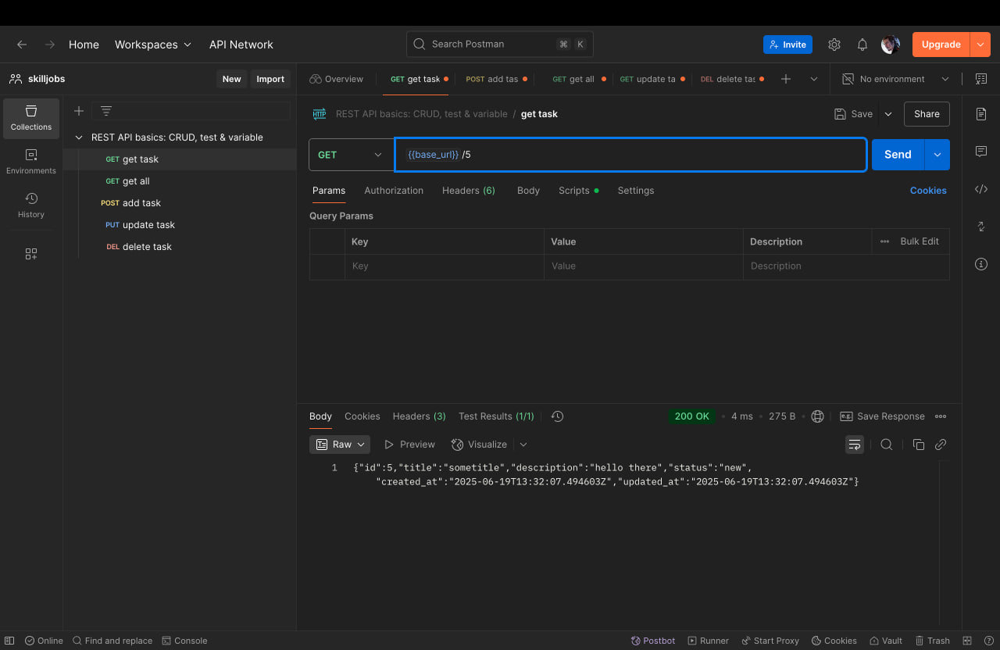
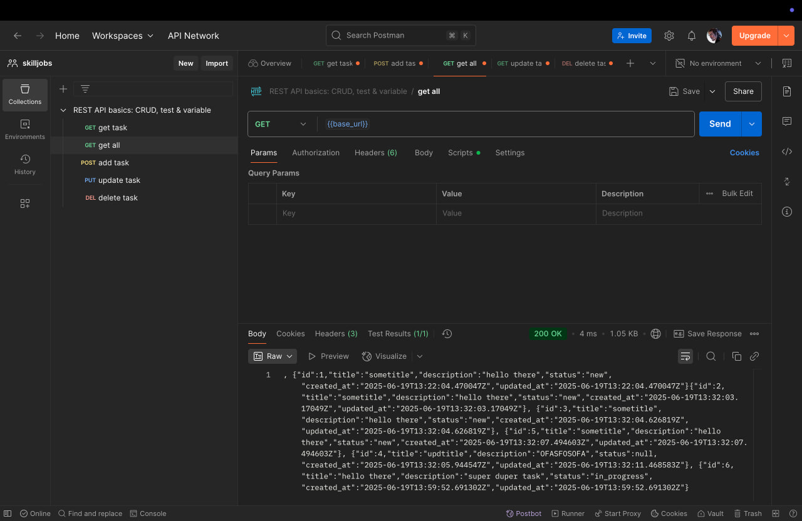
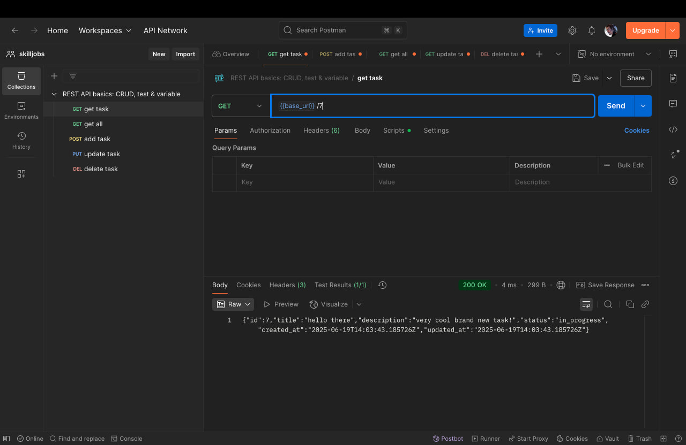
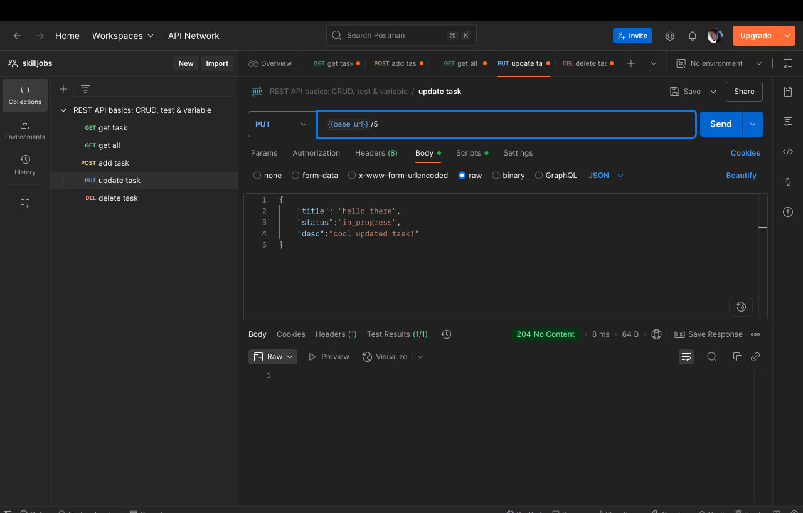
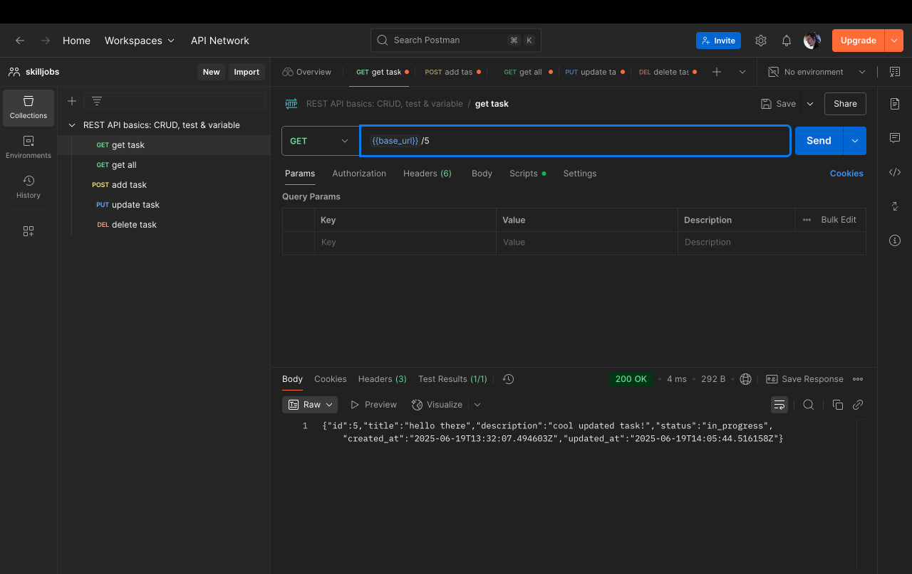
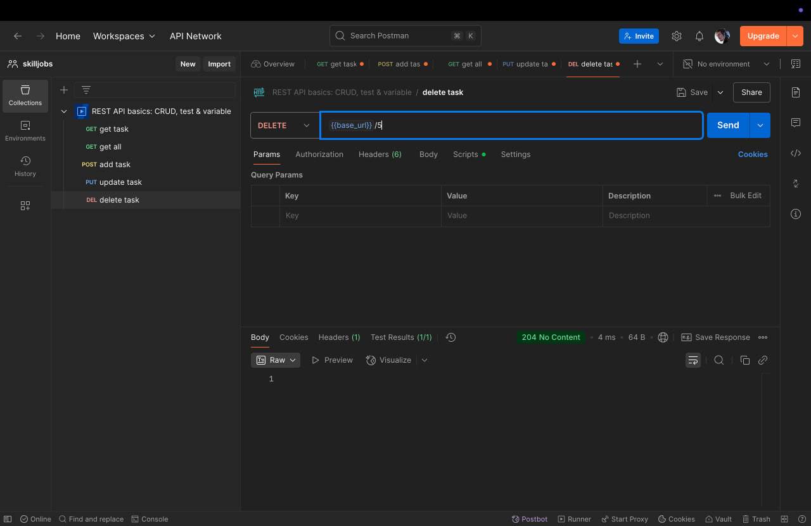
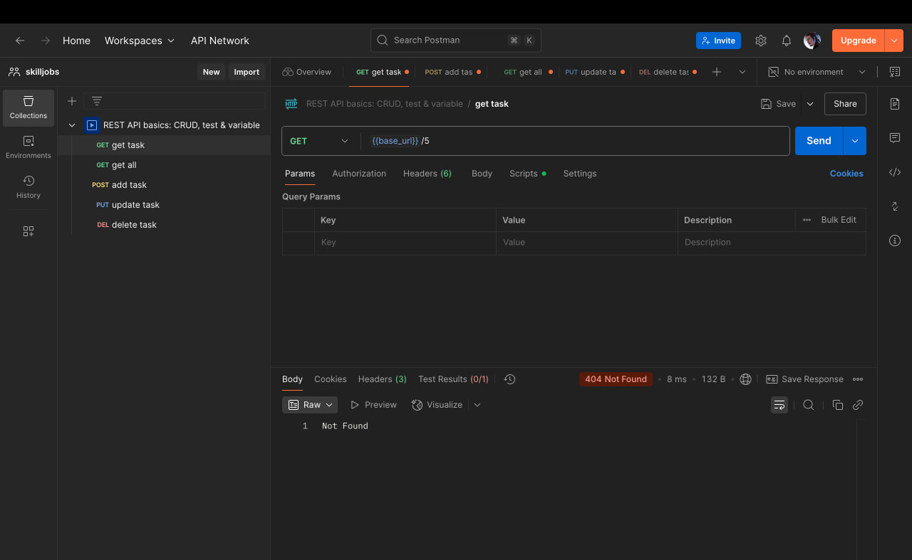

## Дефолтный круд для тасок

Запускается из коробки через docker-compose

### Скрины:

Таска извлекается по id

Таски извлекаются

Таска добавляется
[img_2.png](img_2.png)

Проверяем добавление

Обновляем таску по id

Проверяем обновление

Удаляем таску по id

Проверяем удаление

### Особенности:
- Есть миграции через golang-migrate (поднимаются в коде при запуске приложения)
- Добавил простенький кеш в redis
- Маршалинг/анмаршалинг делал через генератор easyjson
- Добавил докер для бд/кеша/приложения
- Есть простое логгирование